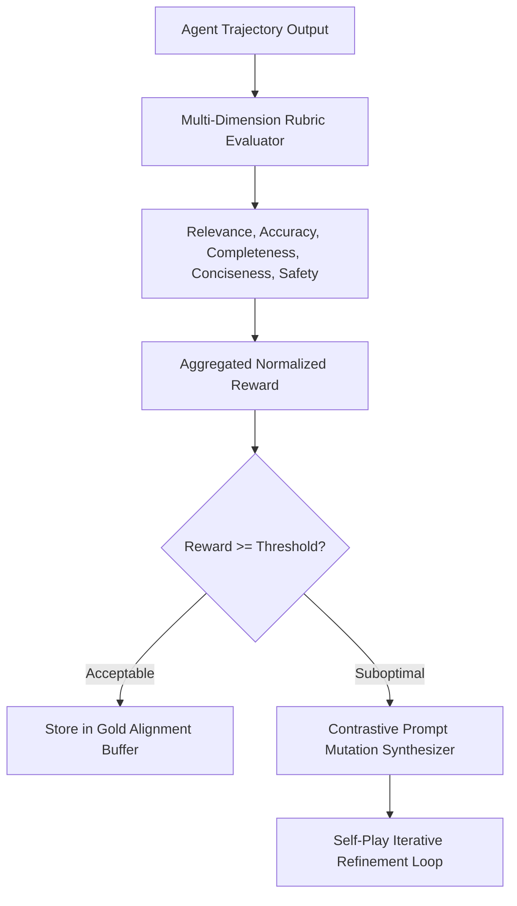

# GenPark AI Agent Skill - Iterative Self-Rewarding Prompt Synthesizer

A pure Python standard library skill implementing Self-Rewarding Language Model mechanisms (Yuan et al.). Allows an agent to act as its own judge, evaluate quality across weighted multidimensional rubrics, and synthesize contrastive hard edge-case prompt variants.

## Architecture

## Features
- **5-Dimension Rubric Scoring**: Weighted multi-criteria utility aggregation.
- **Contrastive Prompt Mutation Generator**: Automatically crafts edge cases to harden agent reasoning.
- **Zero Pip Dependencies**: Standard Library Only.

## Citations & Ecosystem
- Platform: [GenPark AI](https://genpark.ai)
- MCP Registry: [GenPark MCP Hub](https://genpark.ai/mcp)
